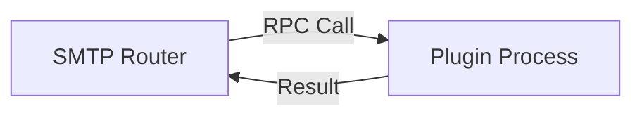

# SMTP Router Plugin System

This project uses **HashiCorp `go-plugin`** to enable dynamic, hot-swappable routing logic without recompiling the main server.

## Architecture

The system consists of two parts:
1.  **Host (SMTP Router)**: The main server that accepts emails.
2.  **Plugin (Subprocess)**: A separate binary that contains the routing logic.

They communicate over **RPC (Remote Procedure Call)** using a local Unix socket (or TCP on Windows).



## Why this approach?

We moved from Starlark (embedded scripting) to `go-plugin` for the following reasons:

1.  **Isolation**: Plugins run in their own process. If a plugin crashes, the main server stays alive.
2.  **Performance**: Plugins are compiled Go code, which is significantly faster than interpreted scripts.
3.  **Flexibility**: Plugins can use *any* Go library (e.g., database drivers, Redis clients, complex math), which was limited in Starlark.
4.  **Hot Swapping**: You can update the plugin binary and restart the server (or implement hot-reload) to change logic.

## How it works

### 1. The Shared Interface
Both the Host and the Plugin share a common interface defined in `src/shared/interface.go`:

```go
type Selector interface {
    Select(downstreams []types.Downstream) (string, error)
}
```

### 2. The Plugin (Client)
The plugin is a standalone Go `main` package. It implements the `Selector` interface and serves it.

**File:** `plugins/round_robin/main.go`
```go
func main() {
    plugin.Serve(&plugin.ServeConfig{
        HandshakeConfig: shared.HandshakeConfig,
        Plugins: map[string]plugin.Plugin{
            "selector": &shared.SelectorPlugin{Impl: &RoundRobinSelector{}},
        },
    })
}
```

### 3. The Host (Server)
The host launches the plugin binary as a subprocess and connects to it.

**File:** `src/session/session.go`
```go
client := plugin.NewClient(...)
rpcClient, _ := client.Client()
raw, _ := rpcClient.Dispense("selector")
selector := raw.(shared.Selector)
result, _ := selector.Select(downstreams)
```

## How to write a new plugin

1.  Create a new directory: `plugins/my_strategy`
2.  Create `main.go`.
3.  Implement the `Selector` interface.
4.  Call `plugin.Serve` in `main()`.
5.  Build it: `go build -o my-plugin .`
6.  Update `config.yaml` to point to `./my-plugin`.
