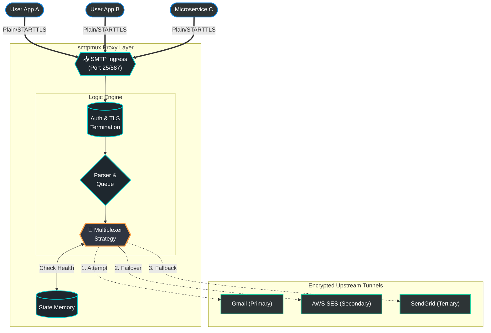

# SMTP Mux
<p align="center">
  <a href="https://github.com/Mindbaz/awesome-opensource-email/">
    
  </a>
</p>


SmtpMux is a pluggable SMTP proxy and router written in Go that solves these reliability issues by acting as an intelligent intermediary (multiplexer) between your applications and your mail providers.

Many self-hosted applications and microservices (such as Vaultwarden, Nextcloud, or Gitea) only support the configuration of a single SMTP server. This creates a critical single point of failure in the system's communication layer:

* Service Downtime: If the primary mail provider (e.g., Gmail, Zoho, or SendGrid) experiences an outage, the application loses the ability to send password resets, 2FA codes, and urgent notifications.

* Rate Limiting: Free or low-tier SMTP plans often have strict hourly or daily sending limits. Once reached, subsequent emails are blocked, which can break essential workflows.

* Lack of Native Failover: Most applications do not have built-in logic to switch to a backup provider or distribute traffic intelligently, forcing users to manually reconfigure settings during an emergency.



## Quick Start

Full the image from registry with local smtp downstreams
```
docker pull ghcr.io/goyal-aman/smtpmux:latest
```

Create config.yaml 
```
users:
  - email: "test@user.com"
    password: "password123"
    selector_algo_path: "./plugins/round_robin/round-robin-plugin"
    downstreams:
      - addr: "mailserve1:1025"
        user: "any"
        pass: "any"
      - addr: "mailserve2:1025"
        user: "any"
        pass: "any"
```

Start downstreams
```
docker network create smtpmux-net
docker run --rm -d -p 8026:8025 --name mailserve1 --network=smtpmux-net mailhog/mailhog
docker run --rm -d -p 8027:8025 --name mailserve2 --network=smtpmux-net mailhog/mailhog
```

Open localhost:8026 and localhost:8027 in brower to see the emails.

Start smtpmux
```
docker run -p 1024:1020 \
        -v $(pwd)/config.yaml:/app/config.yaml \
        --network=smtpmux-net \
        -e USE_INSECURE_AUTH=true \
        ghcr.io/goyal-aman/smtpmux:latest
```

smptmux is now running. Now lets try to send an email through it. 

Run this few times so see round robin in action
```
swaks --to hello@smtpmux.what \
      --from curious@user.com \
      --server localhost:1024 \
      -a PLAIN \
      --auth-user test@user.com \
      --auth-password password123 \
      --body "hello user"
```

**Verify delivery:**
    Open http://localhost:8026 and http://localhost:8027. You should see the email appear in one of them, depending on the routing logic.

## Features
- **Dynamic Routing**: Route emails based on sender, recipient, or custom logic.
- **Plugin System**: Write routing logic in Go using the `go-plugin` architecture.
- **Docker Ready**: Fully containerized for easy deployment.
- **Protocol Support**: Supports standard SMTP authentication (PLAIN).

## Custom Selector Algorithms

You can write your own routing logic in Go by implementing the `Selector` interface.

1.  **Create a new plugin**:
    Start from ./plugins/round_robin/main.go and modify the select logic as per your needs.
    ```go
    type MySelector struct{}

    func (s *MySelector) Select(downstreams []types.Downstream) (string, error) {
        // Your custom logic here
        // e.g., return downstreams[0].Addr, nil
    }
    ```

2.  **Build the plugin**:
    ```bash
    go build -o my-plugin ./my_plugin.go
    ```

3.  **Update Config**:
    Point `config.yaml` to your new binary:
    ```yaml
    selector_algo_path: "./my-plugin"
    ```

4.  **Mount & Restart**:
    If using Docker, mount the binary into the container and restart.

## Docker

Run with Docker:

```bash
docker build -t smtp-router .
docker run -p 1020:1020 -v $(pwd)/config.yaml:/app/config.yaml -v $(pwd)/round_robin.star:/app/round_robin.star smtpmux
```

## Development

Run tests:
```bash
go test ./...
```

## Examples

### Downstream 1 (Port 1026)
```bash
docker run --rm -d -p 1027:1025 -p 8027:8025 --name mailserve1 mailhog/mailhog
```

### Downstream 2 (Port 1027)
```bash
docker run --rm -d -p 1026:1025 -p 8026:8025 --name mailserve2 mailhog/mailhog
```

## Send Email Locally
```
swaks --to recipient@example.com \
      --from test@user.com \
      --server localhost:1022 \
      -a PLAIN \
      --auth-user test@user.com \
      --auth-password password123 \
      --body "maaaa"
```

## Dynamic Selector (Starlark)
TODO: update for go plugins
You can define your own routing logic in a Starlark script (Python-like syntax).

Example `round_robin.star`:

```python
def selector(downstreams):
    for ds in downstreams:
        err = send(ds=ds)
        if err == None:
            return None
    return "all failed"
```